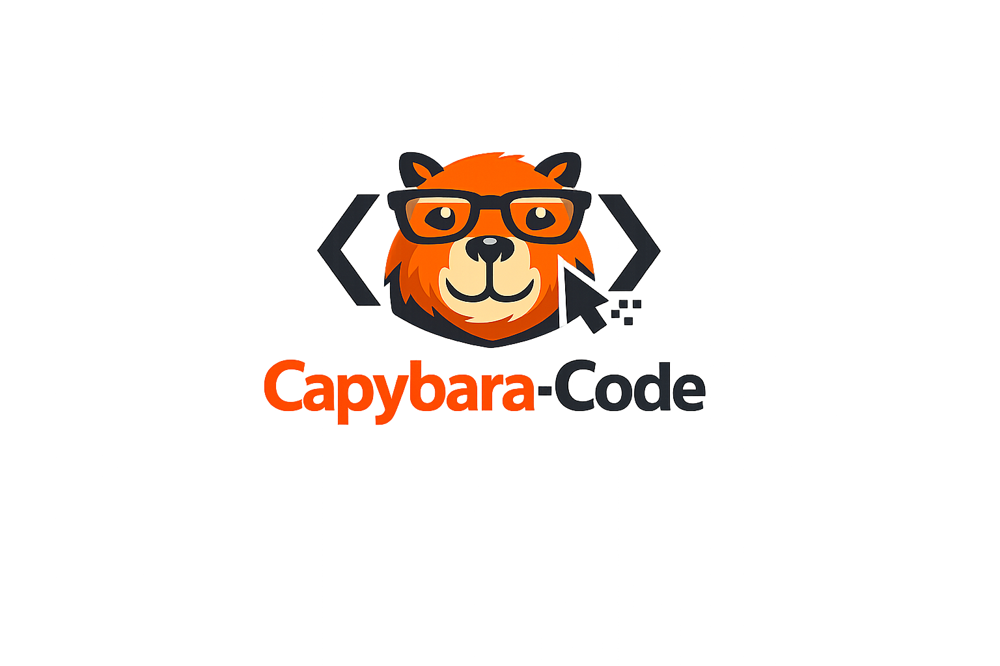

  

<h1 align="center">Capybara Code (`capy`)</h1>

  <b>An experimental, high-performance AI coding agent & harness optimized for GPT models.</b>

  
  
  
  

---

> [!IMPORTANT]
> **Coming Soon:** Capybara Code is currently under initial preparation and internal development. **The source code, installation packages, and pre-built binaries have not been uploaded or published yet.** Stay tuned for the upcoming initial open-source release!

---

## 💡 Overview

**Capybara Code** is an open-source AI coding agent designed to build the **most optimal harness and toolset specifically engineered for GPT models**. 

While base model capabilities are essential, Capybara Code investigates how much performance, reliability, and precision can be maximized through harness engineering—combining a rich Terminal UI, an isolated Rust execution sidecar, transactional file mutations, and multi-agent workflows.

---

## ✨ Planned Features

- 💻 **Interactive Terminal UI (TUI):** Real-time task logs, live token/context tracking, cost estimation, and status indicators.
- ⚡ **Rust-Powered Sidecar:** Safe, transactional file editing with optimistic concurrency, diff reviews, and rollback checkpoints.
- 🔑 **Dual Provider Support:** Direct OpenAI API integration (`capy auth api`) or official ChatGPT/Codex plan support (`capy auth login`).
- 🤖 **Sub-Agent Workflows:** Task delegation across specialized roles (`explore`, `executor`, `architect`, `reviewer`, `test`).
- 🔌 **Extensible Ecosystem:** Support for Model Context Protocol (MCP) servers and reusable `SKILL.md` workflows.
- 🔍 **Context Engine & Repository Map:** Smart symbol search, instruction parsing (`AGENTS.md`), and automated context selection.
- 🤖 **Headless & Automation Mode:** Run tasks non-interactively (`capy run --jsonl`) with machine-readable JSONL event streams.

---

## 🚀 Getting Started (Upcoming)

> [!NOTE]
> Source code and build scripts will be made publicly available upon the initial source release.

### Prerequisites (Planned)

- **[Bun](https://bun.sh/)** (>= 1.3.0)
- **[Rust](https://www.rust-lang.org/)** (>= 1.85 / Stable)

---

## 🎯 Project Goals

Capybara Code was created to explore a single premise: **How far can we push AI agent performance through harness and tool optimization rather than relying solely on base model updates?**

Key Objectives:
- ⚡ **GPT-Optimized Harness & Tools:** Build the most seamless, high-precision toolset and runtime environment tailored specifically to extract maximum performance from GPT models.
- 🚀 **Outperforming Industry Leaders:** Surpass the agentic coding performance, accuracy, and task-completion rates of state-of-the-art tools like **Claude Code** and **OpenCode**.
- 🧠 **Advanced Agent Workflows:** Push the boundaries of automated coding through robust planning, multi-agent orchestration, atomic verification, and intelligent context management.

---

## 🤝 Contributing & Community

We warmly welcome all forms of community involvement! 

- 💡 **Feature Ideas & Suggestions:** Have a thought on improving our harness design or tools? Share it with us!
- 🐛 **Bug Reports & Issues:** Found a problem or edge case? Let us know so we can fix it.
- 🔀 **Pull Requests & Feedback:** Contributions of any size—from docs to code—are greatly appreciated.

★ **Star or watch this repository** to receive updates when the initial source code and developer preview are officially released!

---

## 📄 License

Licensed under the **[Apache License 2.0](LICENSE)**.
